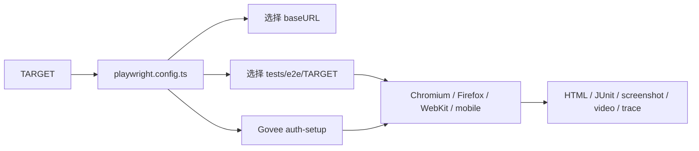

# web-ui-tests

`web-ui-tests` 是一个基于 Playwright 和 TypeScript 的远程网站端到端测试项目。仓库不包含被测应用源码，也不需要构建应用；测试会直接访问配置好的远程网站。

当前支持以下被测项目：

| TARGET | 远程地址 | 测试目录 |
| --- | --- | --- |
| `runoob` | `https://www.runoob.com/` | `tests/e2e/runoob/` |
| `govee-community` | `https://dev-community.govee.com/` | `tests/e2e/govee-community/` |

## 项目结构

```text
web-ui-tests/
|-- .github/workflows/playwright.yml   # GitHub Actions 工作流
|-- specs/                             # 测试计划与探索文档
|   |-- runoob/
|   `-- govee-community/
|-- tests/e2e/                         # Playwright 可执行用例
|   |-- runoob/
|   `-- govee-community/
|-- playwright.config.ts               # TARGET、浏览器、超时和报告配置
|-- package.json                       # npm 命令与依赖
|-- .env.example                       # Govee 登录变量模板
|-- Jenkinsfile                        # Jenkins 流程
`-- AGENTS.md                          # 仓库贡献规范
```

`specs/` 保存测试需求、计划和探索结论，`tests/e2e/` 保存真正执行的自动化代码。两者不一致时，以当前测试代码为实际执行依据。

## 配置与执行流程

`playwright.config.ts` 根据环境变量 `TARGET` 完成测试隔离：



未设置 `TARGET` 时默认执行 `runoob`。如需临时测试其他环境，可使用 `BASE_URL` 覆盖目标项目的默认地址。

## 测试模块

### Runoob

Runoob 用例覆盖首页可访问性、页面标题、`Python / 数据科学` 分类和`前端开发`分类。

### Govee Community

| 目录 | 职责 |
| --- | --- |
| `login/` | 登录、QQ 邮箱验证码读取、认证状态保存 |
| `public-home-discovery/` | 公开首页、内容筛选、搜索、未登录发帖门禁 |
| `authenticated-home-publishing/` | 已登录首页、内容入口、草稿弹窗 |
| `club/` | Club 详情、筛选、加入与退出 |
| `responsive/` | 移动端首页布局 |
| `support/` | Support 页面和详情导航 |

## 环境准备

建议使用 Node.js 24。从仓库根目录安装锁定依赖和 Playwright 浏览器：

```powershell
npm ci
npx playwright install
```

只需运行 Chromium 时，也可以仅安装 Chromium：

```powershell
npx playwright install chromium
```

## Govee 登录配置

运行 Govee Community 测试前，创建本地环境变量文件：

```powershell
Copy-Item .env.example .env
```

在 `.env` 中填写测试账号：

```dotenv
GOVEE_TEST_EMAIL=测试邮箱
GOVEE_TEST_PASSWORD=测试密码
QQ_IMAP_AUTH_CODE=QQ邮箱授权码
```

登录成功后，`tests/e2e/govee-community/login/auth.setup.ts` 会将 Cookie、localStorage 和 IndexedDB 保存到：

```text
.auth/govee-community.auth-state.json
```

出现新设备校验时，`qq-mail.ts` 会通过 QQ IMAP 获取最新四位验证码。`.env`、`.auth/`、测试报告和失败产物均已被 Git 忽略，禁止将真实凭据提交到仓库。

Govee 测试固定使用单 worker，避免共享账号、草稿和 Club membership 状态发生并发冲突。公开场景会显式使用空 `storageState`，不会继承登录状态。

## 常用命令

### 运行单个远程项目

仅运行 Chromium：

```powershell
$env:TARGET='runoob'
npm run test:e2e

$env:TARGET='govee-community'
npm run test:e2e
```

运行 Chromium、Firefox、WebKit 和 mobile 完整矩阵：

```powershell
$env:TARGET='govee-community'
npm run test:e2e:all
```

### 运行单个用例

```powershell
$env:TARGET='govee-community'
npx playwright test club/club-membership-join-and-leave.spec.ts --project=chromium
```

### 调试测试

```powershell
npm run test:e2e:headed
npm run test:e2e:ui
```

## 报告与失败排查

测试产物按 TARGET 隔离：

```text
playwright-report/{TARGET}/
test-results/{TARGET}/junit.xml
test-results/{TARGET}/artifacts/
```

失败时 Playwright 会保留 screenshot、video 和 trace。打开指定项目的 HTML 报告：

```powershell
npx playwright show-report playwright-report/govee-community
```

排查失败时，先查看 HTML 报告中的错误和截图，再结合 video 确认操作过程，最后使用 trace 检查 DOM、请求、响应和动作时序。

## GitHub Actions

`.github/workflows/playwright.yml` 当前只安装并执行 Chromium：

- 手动运行可选择 `runoob`、`govee-community` 或 `all`。
- push 到 `main` 时默认执行全部项目。
- 定时任务在北京时间每天 `02:00` 触发。
- 定时执行范围由 Repository Variable `SCHEDULE_TARGETS_JSON` 控制。
- Govee 登录信息来自 GitHub Actions Secrets。
- 每个 TARGET 独立生成并上传报告和测试产物。

`SCHEDULE_TARGETS_JSON` 必须是合法 JSON，例如：

```json
["govee-community"]
```

或：

```json
["runoob", "govee-community"]
```

GitHub Actions Secrets 必须配置以下名称：

```text
GOVEE_TEST_EMAIL
GOVEE_TEST_PASSWORD
QQ_IMAP_AUTH_CODE
```

## Jenkins

仓库保留了 `Jenkinsfile`，但它仍采用旧的单 `BASE_URL` 参数和旧 JUnit 路径。正式使用 Jenkins 前，应将它同步到当前的 `TARGET` 和按项目隔离的报告结构。当前推荐使用 GitHub Actions。

## 新增远程项目

新增一个被测项目时，需要同步完成以下修改：

1. 在 `playwright.config.ts` 的 `targets` 中增加项目名称和 `baseURL`。
2. 新建 `tests/e2e/{target}/` 并添加 `.spec.ts` 用例。
3. 新建 `specs/{target}/` 并记录测试计划。
4. 将项目名称加入 GitHub Actions 的手动选项和默认 matrix。
5. 如需认证，增加独立的 auth setup、storage state 和 GitHub Secrets。

### 新增项目操作示例

下面以新增 `example-project` 为例，假设远程地址为 `https://example.com/`。

#### 1. 注册 Playwright TARGET

在 `playwright.config.ts` 的 `targets` 中增加项目：

```ts
const targets = {
  runoob: {
    baseURL: 'https://www.runoob.com/',
  },
  'govee-community': {
    baseURL: 'https://dev-community.govee.com/',
  },
  'example-project': {
    baseURL: 'https://example.com/',
  },
} as const;
```

项目名称必须与测试目录和 GitHub Actions 配置完全一致，包括大小写和连字符。

#### 2. 创建项目目录

```powershell
New-Item -ItemType Directory -Path tests/e2e/example-project
New-Item -ItemType Directory -Path specs/example-project
```

将可执行用例放在 `tests/e2e/example-project/`，并使用 `.spec.ts` 后缀；将测试计划放在 `specs/example-project/`。

#### 3. 添加 GitHub Actions 手动选项

在 `.github/workflows/playwright.yml` 的 `workflow_dispatch.inputs.target.options` 中加入新项目：

```yaml
options:
  - runoob
  - govee-community
  - example-project
  - all
```

workflow 合并到默认分支后，GitHub Actions 的 `Run workflow` 下拉框才会显示 `example-project`。

#### 4. 加入默认 matrix

将 workflow matrix 表达式中的默认项目列表从：

```yaml
'["runoob","govee-community"]'
```

改为：

```yaml
'["runoob","govee-community","example-project"]'
```

完整配置示意：

```yaml
strategy:
  fail-fast: false
  matrix:
    target: ${{ fromJSON(github.event_name == 'workflow_dispatch' && inputs.target != 'all' && format('["{0}"]', inputs.target) || github.event_name == 'schedule' && vars.SCHEDULE_TARGETS_JSON || '["runoob","govee-community","example-project"]') }}
```

不需要为新项目复制一个 Job。matrix 会自动创建独立的 `example-project Chromium Tests` Job。默认列表用于 push 到 `main`、手动选择 `all`，以及定时 Variable 缺失或为空的场景。

#### 5. 更新定时任务 Variable

如果 GitHub 已配置 `SCHEDULE_TARGETS_JSON`，定时任务会优先读取该 Variable，不会自动采用 workflow 中的新默认列表。进入：

```text
Settings > Secrets and variables > Actions > Variables
```

定时执行全部三个项目：

```json
["runoob", "govee-community", "example-project"]
```

只定时执行新项目：

```json
["example-project"]
```

只执行部分项目：

```json
["govee-community", "example-project"]
```

Variable 必须是合法 JSON，且其中的名称必须已在 `playwright.config.ts` 中注册。

#### 6. 配置认证信息

如果新项目需要登录，使用项目专属的环境变量和 GitHub Actions Secrets，例如：

```text
EXAMPLE_TEST_EMAIL
EXAMPLE_TEST_PASSWORD
```

同时在 workflow 的 `env` 和新项目的 auth setup 中使用相同名称。不要复用或硬编码其他项目的账号。

#### 7. 本地验证项目隔离

先确认 Playwright 只发现新目录中的用例：

```powershell
$env:TARGET='example-project'
npx playwright test --project=chromium --list
```

再执行 Chromium 测试：

```powershell
npm run test:e2e
```

#### 8. 提交修改

```powershell
git add playwright.config.ts .github/workflows/playwright.yml tests/e2e/example-project specs/example-project
git diff --cached --check
git commit -m "Add example project Playwright target"
git push
```

提交前应再次确认以下四处名称一致：`targets` 配置键、`tests/e2e/` 目录名、workflow 手动选项和 `SCHEDULE_TARGETS_JSON`。

## 编码与提交约定

- 使用 TypeScript、两个空格缩进、单引号和分号。
- 测试文件使用 `*.spec.ts`；认证准备文件使用 `*.setup.ts`。
- 优先使用 `getByRole`、`getByText` 等语义定位器。
- 测试应相互隔离，并对远程数据波动设置明确的等待或失败策略。
- 提交前至少运行目标项目的 Chromium 用例，并检查 `test-results/` 中的失败产物。
- 不提交 `.env`、`.auth/`、`playwright-report/`、`test-results/` 或真实账号信息。
